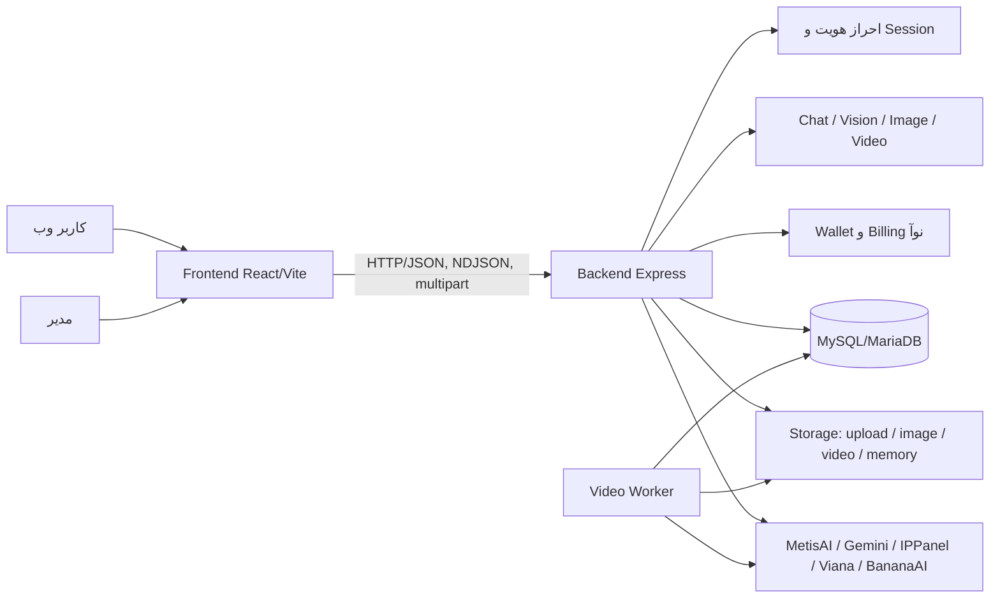

# مستندات فنی و محصول دانوآ

> مرجع مستندات پروژه — آخرین بازبینی: ۲۰۲۶-۰۸-۱۵

دانوآ یک همراه گفت‌وگومحور فارسی برای کودکان و نوجوانان ۸ تا ۱۸ سال است. محصول از چت هوش مصنوعی، تحلیل و تولید/ویرایش تصویر، تولید ویدیو، احراز هویت، کیف پول نوآ و پنل مدیریت تشکیل شده است.

این پوشه مرجع قابل استفاده برای توسعه‌دهنده، مدیر محصول، تیم عملیات و تیم پشتیبانی است. جزئیات اجرایی باید با کد فعلی پروژه هم‌خوان باشد؛ در صورت اختلاف، کد و تست‌های اجرایی منبع نهایی حقیقت هستند.

## مسیر مطالعه پیشنهادی

### شروع سریع

- [راه‌اندازی محیط توسعه](./getting-started.md)
- [تنظیمات و متغیرهای محیطی](./configuration.md)
- [راهنمای تست و توسعه](./development-and-testing.md)

### درک سیستم

- [نمای معماری](./architecture-overview.md)
- [مرجع API](./api-reference.md)
- [مدل داده و مهاجرت‌ها](./data-model.md)
- [وضعیت قابلیت‌های محصول](./current-state.md)

### انتشار و نگهداری

- [راهنمای عملیات و استقرار](./operations.md)
- [امنیت، حریم خصوصی و ایمنی](./security-and-privacy.md)
- [راهنمای Frontend و Design System](./frontend-and-design-system.md)

### اسناد موجود قبلی

- [Baseline معماری](./architecture.md)
- [PRD محصول](./prd/README.md)
- [پرامپت ساخت دانوآ از صفر](./prd/PROMPT_FROM_ZERO_TO_DANOA.md)
- [استقرار تولید ویدیو روی VPS](./danoa-vps-video-deployment.md)
- [خلاصه استقرار تولید ویدیو](./video-generation-deployment.md)
- [پرامپت‌های ویدیو](./video-prompts/)

## نقشه کلی سیستم

## قواعد نگهداری مستندات

1. هر قابلیت جدید باید هم‌زمان با API، تنظیمات، محدودیت‌ها و روش تست مستند شود.
2. کلیدها، tokenها، cookie valueها، شماره‌های واقعی و اطلاعات کاربران هرگز در مستندات یا commit قرار نگیرند.
3. مسیرهای فایل و endpointها باید با source فعلی تطبیق داده شوند؛ از مستندسازی routeهای فرضی خودداری شود.
4. تغییرات behavior یا قرارداد API باید در همین پوشه و در صورت نیاز در PRD ثبت شوند.
5. تاریخ بازبینی هر سند در ابتدای آن درج شود.

## شاخص وضعیت اسناد

| نشانه | معنی |
|---|---|
| ✅ | مستند و قابل استفاده بر اساس کد فعلی |
| ⚠️ | وابسته به تنظیمات محیط یا provider خارجی |
| 🧭 | نیازمند تصمیم محصول یا تکمیل آینده |

