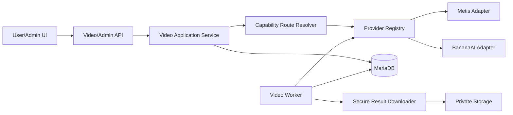
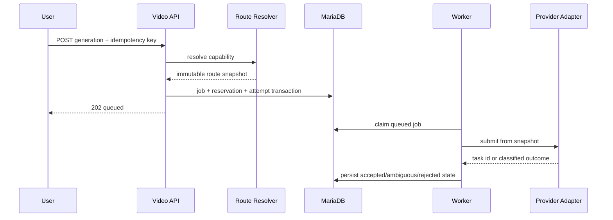
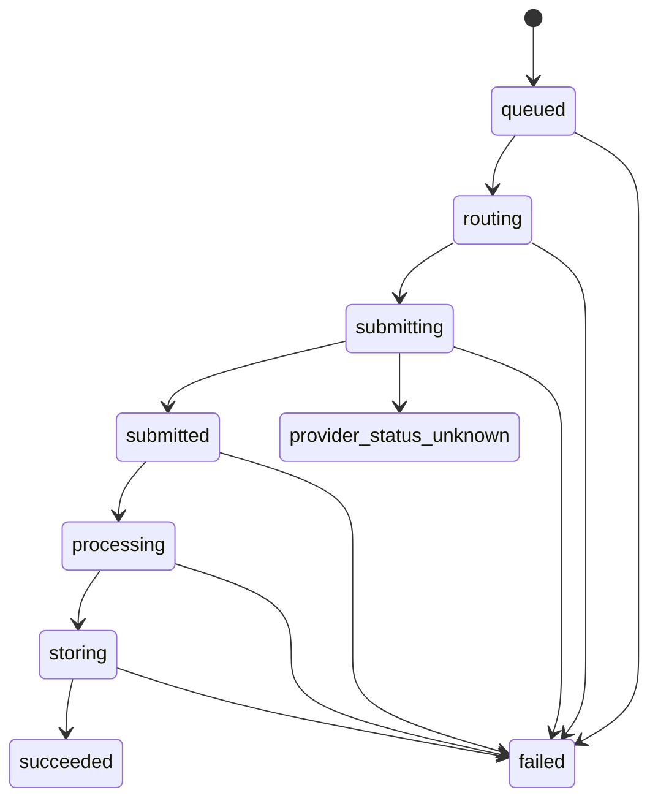
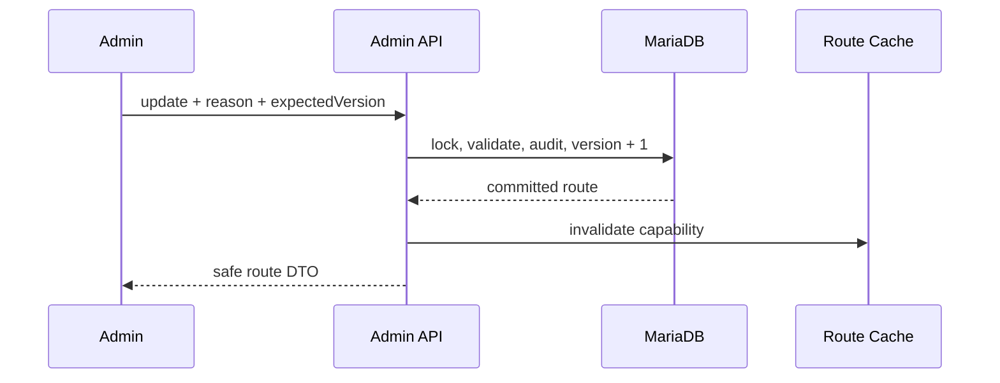
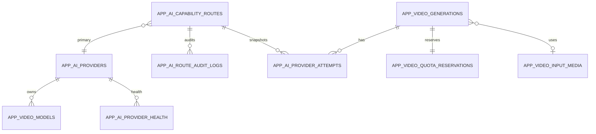

# AI Routing Architecture

## Component diagram



## Request sequence



## Fallback sequence

```mermaid
sequenceDiagram
  participant W as Worker
  participant P as Primary
  participant D as Database
  participant F as Fallback
  W->>P: submit
  alt confirmed rejection without task id
    P-->>W: documented rejection
    W->>D: close attempt 1; create attempt 2
    W->>F: submit same job/reservation
  else accepted or ambiguous
    P-->>W: task id or uncertain outcome
    W->>D: accepted or provider_status_unknown
    Note over W,F: no fallback
  end
```

## Job state machine



## Admin route change



## Database relationships


