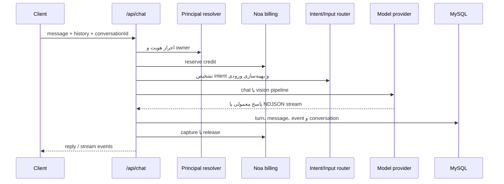

# نمای معماری دانوآ

> وضعیت: ✅ baseline اجرایی — بازبینی: ۲۰۲۶-۰۸-۱۵

## هدف معماری

معماری فعلی برای تغییرات مرحله‌ای و کم‌ریسک طراحی شده است. هدف، جداسازی مسئولیت‌ها، جلوگیری از اتصال مستقیم featureها به زیرساخت و حفظ رفتار فعلی در refactorهاست.

## لایه‌ها

### Frontend

مسیر اصلی `frontend/` است و با React، TypeScript و Vite ساخته شده است.

- صفحات اصلی: landing، chat، image studio، video studio و admin.
- سرویس‌های feature در مسیرهای `src/services/`، `src/noa/` و `src/video-generation/` قرار دارند.
- session در `src/auth/` مدیریت می‌شود.
- primitives مشترک در `src/design-system/` هستند.

### Bootstrap و Composition در backend

نقطه ورود `backend/src/server.js` است.

مسئولیت‌ها:

- بارگذاری env و پیکربندی.
- ساخت Database client، repositoryها و serviceها.
- ثبت middlewareهای CORS، Helmet، compression، cookie parser، JSON و CSRF.
- mount کردن routeها.
- مقداردهی دیتابیس، worker و monitorها.
- سرو فایل build شده frontend.

Business logic دامنه نباید به‌صورت جدید داخل `server.js` اضافه شود؛ منطق باید در module/service مربوط قرار بگیرد.

### Modules

هر module یک دامنه یا capability را کپسوله می‌کند:

| دامنه | مسیر | مسئولیت |
|---|---|---|
| Auth | `modules/auth` | OTP، profile، session و Viana OAuth |
| AI | `modules/ai` | چت، routing، prompt، stream و ثبت turn |
| Vision | `modules/image-understanding` | تحلیل تصویر و pipeline vision-chat |
| Image | `modules/image-generation` | generate، edit، status و storage |
| Video | `modules/video-generation` | job، provider، worker و محتوای خروجی |
| Noa | `modules/noa` | اعتبار، reservation، capture/release و receipt |
| Conversations | `modules/conversations` | CRUD و title گفتگو |
| Admin | `modules/admin` و `adminRoutes.js` | تنظیمات، گزارش، moderation و کاربران |
| Memory | `modules/conversation-memory` | ساخت، ذخیره و بازسازی حافظه گفتگو |
| Routing | `modules/ai-routing` | provider/model/capability routing |
| Health | `modules/health` | سلامت داخلی، upstream و video |

### Repository و persistence

Repositoryها در `backend/src/repositories/` دسترسی SQL و queryها را متمرکز می‌کنند. Moduleها نباید برای عملیات جدید مستقیماً query پراکنده در controller بنویسند.

## جریان درخواست چت

## جریان تولید ویدیو

1. کاربر از `/api/video-generations/options` گزینه‌های قابل عرضه را می‌خواند.
2. تصویر ورودی، در صورت نیاز، از مسیر input media دریافت و در storage خصوصی نگهداری می‌شود.
3. `POST /api/video-generations` یک job idempotent ایجاد می‌کند و credit را reserve می‌کند.
4. worker job را lease می‌کند، به provider می‌فرستد و status را poll می‌کند.
5. خروجی provider با allowlist host/path و محدودیت حجم دانلود می‌شود.
6. فایل در storage خصوصی ذخیره و billing capture می‌شود؛ در خطا reservation release می‌شود.
7. کاربر با content endpoint احراز‌شده خروجی را می‌خواند.

## قرارداد مالکیت داده

- هر user-facing resource باید به user/session معتبر resolve شود.
- تصویر، conversation، video job و wallet نباید با شناسه حدس‌پذیر بدون بررسی مالکیت برگردانده شوند.
- مسیرهای admin با cookie نشست ادمین و role guard محافظت می‌شوند.
- provider URL و کلید API فقط در backend باقی می‌مانند.

## قواعد تغییر معماری

- تغییر هر module باید تا حد ممکن API و state موجود را حفظ کند.
- refactorهای frontend باید behavior-preserving باشند.
- feature جدید قبل از اتصال به provider، قرارداد ورودی/خروجی، timeout، retry، billing و observability داشته باشد.
- migrationهای دیتابیس additive و قابل اجرای مجدد طراحی شوند.
- تصمیم‌های غیرقابل بازگشت محصولی در کد پنهان نشوند؛ در config یا سند تصمیم ثبت شوند.

