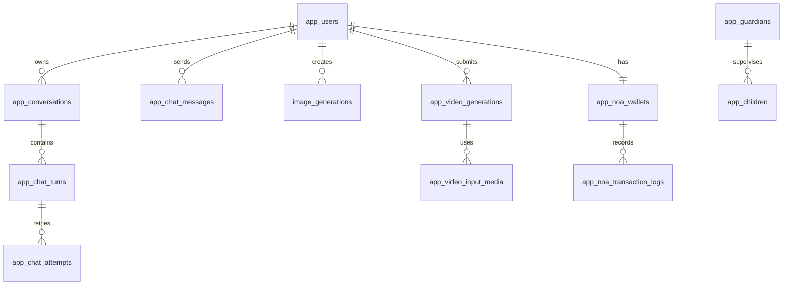

# مدل داده و چرخه مهاجرت

> وضعیت: ✅ مرجع persistence — بازبینی: ۲۰۲۶-۰۸-۱۵

## پایگاه داده

داده‌ها در MySQL/MariaDB با charset `utf8mb4` نگهداری می‌شوند. اتصال از `DATABASE_URL` ساخته می‌شود و `DatabaseClient` pool با محدودیت connection ایجاد می‌کند.

## جداول اصلی

| حوزه | جدول‌ها | کاربرد |
|---|---|---|
| هویت | `app_users`, `app_guardians`, `app_children` | کاربر، سرپرست و پروفایل کودک |
| session | `app_auth_sessions`, `app_viana_oauth_flows`, `app_viana_identities` | session داخلی و flow OAuth |
| گفتگو | `app_conversations`, `app_chat_messages`, `app_chat_turns`, `app_chat_attempts` | گفتگو، پیام، turn و تلاش‌های stream |
| حافظه | `conversation_documents`, `conversation_document_updates` | snapshot و update حافظه گفتگو |
| AI telemetry | `app_events`, `app_app_errors`, `app_request_metrics`, `input_optimizations` | رخداد، خطا، زمان پاسخ endpoint و optimizer |
| تنظیمات | `app_settings` | config قابل مدیریت در runtime |
| تصویر | `image_generations` | task، prompt، نتیجه و storage تصویر |
| برنامه/سهمیه | `app_plans`, `app_plan_daily_usage`, `app_plan_hourly_usage` | پلن‌ها و quota |
| ویدیو | `app_video_models`, `app_video_generations`, `app_video_*` | job، provider، quota، input و result storage |
| routing | `app_ai_providers`, route/model/attempt tables | انتخاب provider و قابلیت |
| نوآ | جداول `app_noa_*` | wallet، ledger، reservation، receipt و pricing |
| OTP مدیریتی | `app_supervised_otp_config`, `app_supervised_otp_usage` | OTP supervised و مصرف آن |

نام دقیق همه ستون‌ها در `backend/schema.mysql.sql`، `DatabaseClient.js` و migrationهای مربوط قرار دارد؛ این سند intentionally فهرست دامنه‌ای می‌دهد تا با تغییرات additive از schema عقب نماند.

## روابط کلیدی



## invariantهای مهم

- `app_users.user_id` شناسه مالک اصلی است و child account با `app_children.child_id` به user مربوط می‌شود.
- گفتگو با ترکیب user و `conversation_id` یکتا است.
- هر turn می‌تواند چند attempt داشته باشد، اما وضعیت نهایی turn باید با attempt نهایی سازگار بماند.
- `image_generations.task_id` یکتا است و idempotency در سطح مالک کاربر enforce می‌شود.
- reservation نوآ نباید دوبار capture شود؛ عملیات مصرفی باید idempotency key داشته باشد.
- داده و فایل ویدیو باید با هم سازگار بمانند؛ حذف volume بدون metadata ممنوع است.

## راهبرد migration

### schema پایه

در startup، جدول‌های پایه و بخشی از schemaهای auth/session/noa با `CREATE TABLE IF NOT EXISTS` و helperهای ensure ساخته می‌شوند.

### migrationهای دامنه‌ای

فایل‌های `backend/migrations/001_*.sql` تا `044_*.sql` تغییرات افزایشی را پوشش می‌دهند؛ از جمله:

- image generation و gallery
- guest limits و plan quota
- guardian/child و consent
- chat messages، streaming turns و input optimization
- conversation memory و title
- video generation، worker، result storage، routing و prompt profiles
- Noa credit system، receipt و مدیریت wallet
- Viana OAuth session و OIDC nonce

### روش اجرای امن

1. از DB و volumeهای مرتبط backup بگیرید.
2. migration را روی staging اجرا کنید.
3. idempotency و indexهای جدید را بررسی کنید.
4. smoke test endpointهای مربوط را اجرا کنید.
5. سپس در production اجرا کنید.

اسکریپت‌های مهم:

```bash
npm run db:migrate-json --prefix backend
npm run db:migrate-user-ids --prefix backend
npm run db:migrate-image-studio --prefix backend
npm run db:migrate-video-generation --prefix backend
npm run db:migrate-noa --prefix backend
```

از تغییر دستی migrationهای اجراشده خودداری کنید؛ migration جدید اضافه کنید.

## backup و retention

- backup دیتابیس باید با `generated-images`، `conversation-memory` و volumeهای video هماهنگ باشد.
- فایل‌های موقت video input و result temp باید طبق retention تنظیمات پاک شوند.
- حذف کاربر باید اثر cascade/retention روی conversation، image، event و wallet را مشخص کند.
- قبل از پاک‌سازی، audit و نیازهای قانونی/محصولی نگهداری داده را بررسی کنید.
