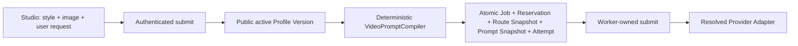

# معماری Video Prompt Profiles

## مرزبندی

- `video-prompt-profiles`: نگهداری Profile/Version، قواعد canonical و Compilation محلی.
- `video-generation`: اعتبارسنجی مالکیت، Route resolve، Reservation و Snapshot اتمیک.
- `video worker`: فقط `compiled_prompt` ذخیره‌شده را به Adapter می‌دهد؛ Profile جاری را نمی‌خواند.
- `ai-routing`: Provider/Model را مستقل از سبک Prompt انتخاب می‌کند.

## Versioning

`app_video_prompt_profiles` metadata عمومی و اشاره‌گر `current_version_id` را نگه می‌دارد. متن کامل مرجع، Execution Template، Rules Manifest و checksum در `app_video_prompt_profile_versions` immutable هستند. تغییر Prompt همیشه یک row جدید و Audit می‌سازد و با optimistic lock اشاره‌گر جاری را جابه‌جا می‌کند.

## Compiler

Compiler نسخه ۲ شش بخش پایدار می‌سازد: `SYSTEM PROMPT`، `STYLE PROFILE`، `NON-NEGOTIABLE RULES`، `USER REQUEST`، `DIRECTING DECISIONS` و `OUTPUT QUALITY`. متن کامل فایل TXT نسخه‌شده در بخش اول قرار می‌گیرد و Execution Template نیز در بخش سبک وارد می‌شود. قواعد canonical موجود در کد با قواعد Version merge می‌شوند؛ بنابراین حتی Version مدیریتی ناقص نیز نمی‌تواند قواعد غیرقابل حذف را حذف کند. User Prompt پایین‌تر از همه قواعد قرار می‌گیرد، control characterها حذف و whitespace به‌صورت NFKC normalize می‌شود.

Compiler هیچ HTTP client، Provider registry، Quota service، upload یا Secret دریافت نمی‌کند.

## Snapshot

Migration 035 ستون‌های `prompt_profile_id`، `prompt_profile_version_id`، `prompt_profile_key`، `prompt_profile_version`، `prompt_compiler_version`، `user_prompt`، `compiled_prompt` و `compiled_prompt_hash` را به همان `app_video_generations` اضافه می‌کند. Job قدیمی با تغییر Profile تغییر نمی‌کند.

## امنیت و Redaction

- API عمومی فقط metadata پروفایل و capability عمومی Route را بازمی‌گرداند.
- Public Job DTO، Provider، Model، Task ID، System Prompt و Compiled Prompt را برنمی‌گرداند.
- Admin Preview محلی است و فقط پشت authorization کار می‌کند.
- Promptها در logهای معمولی ثبت نمی‌شوند.
- تصویر ورودی همان Storage خصوصی و Gateway موقت HMAC قبلی را reuse می‌کند.
